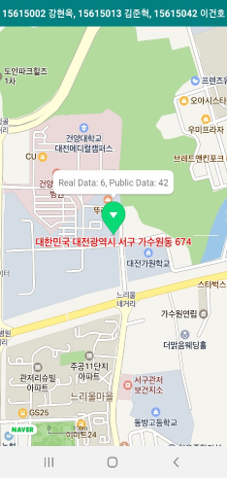

# Finedust_Check_App
> 학부생 3학년 2학기 때 개발한 현재 위치에 대해 공공데이터와 미세먼지센서값을 비교 출력하는 앱

## Installation

-

## Usage example

오렌지보드, 미세먼지센서와 네이버지도API, 공공DB를 이용한 현재 위치에 대한 미세먼지값을 출력하는 모바일 애플리케이션 개발

## Development setup

OS: Android 9

## Release History

* 1.0.0
    * first
    * 개발 완료

## Meta

김준혁 – wnsgur1198@naver.com

## Contributing

1. Fork it (<https://github.com/yourname/yourproject/fork>)
2. Create your feature branch (`git checkout -b feature/fooBar`)
3. Commit your changes (`git commit -am 'Add some fooBar'`)
4. Push to the branch (`git push origin feature/fooBar`)
5. Create a new Pull Request

<!-- Markdown link & img dfn's -->
